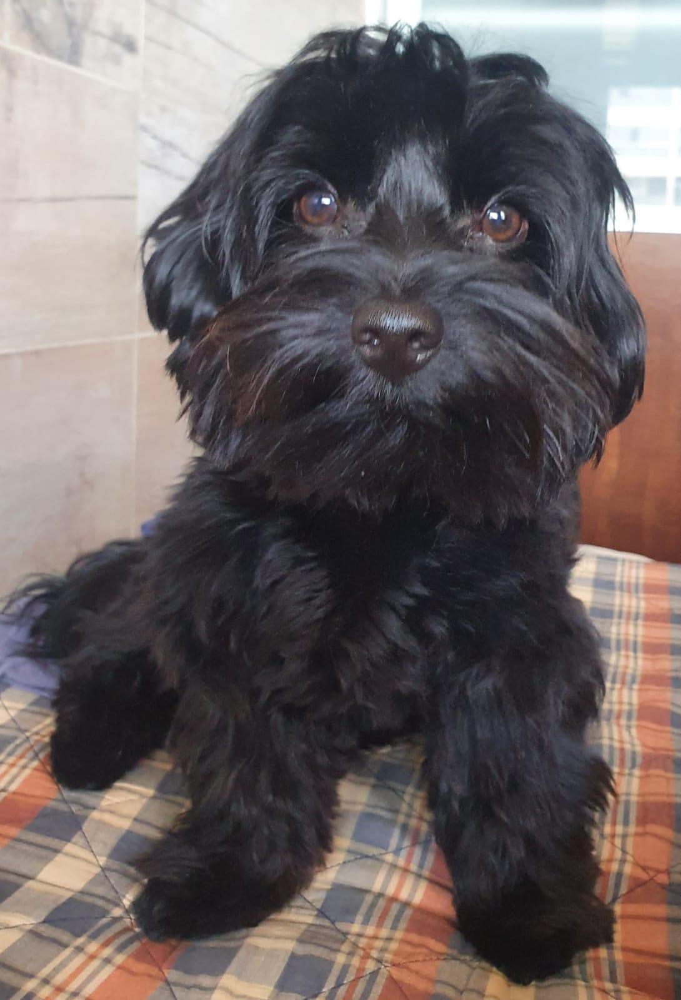

# Unico Challenge  - Dog Bread Recognition 

## Description

Deep Learning application to recognize dogs breeds. <br/>

<p align="center">
  
</p>


# Depedencies
```
pip3 install --upgrade pip
pip3 install torch torchvision --extra-index-url https://download.pytorch.org/whl/cu113
pip3 install -r requirements.txt
```

# Preprocessing dataset
Before training the model the dataset must be organized in training, validation and test data. For some reason there are some black images in the dataset. In order to prevent those image to disturb the training process, a black image filter was implemented. Run the following command to organize and filter the black images from the dataset.
```
cd Dataset_tools
python3 Organize.py --dataset [PATH] --black_img_filter
```

# Downloading preprocessed dataset
To download the already preprocessed dataset at: https://drive.google.com/drive/u/0/folders/1WEAnqEMmITJAkR4kX3j9zWqcdfpr8na_ .


# Start Web Application
In order to access the web application interface run the following command. Then, go in your favorite browser to ```localhost:5000```
```
cd Front_End
python3 parser_app.py
```

